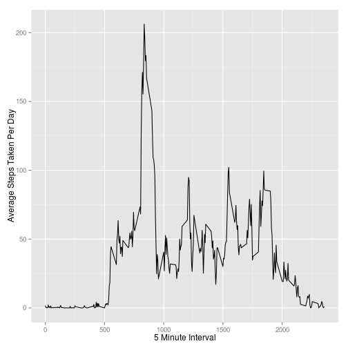

# Reproducible Research: Peer Assessment 1


## Loading and preprocessing the data

```r
setwd("/home/rithesh/RepData_PeerAssessment1")
data <- read.csv("activity.csv")
```

## What is mean total number of steps taken per day?


```r
library(ggplot2)
completedata <- data[complete.cases(data),]
steps_per_day <- with(completedata,aggregate(steps,by=list(date=date),FUN=sum))
qplot(steps_per_day[,2],geom="histogram")
```

```
## stat_bin: binwidth defaulted to range/30. Use 'binwidth = x' to adjust this.
```

 


```r
meansteps <- mean(steps_per_day[,2])
mediansteps <- median(steps_per_day[,2])
```

*Mean* total number of steps taken per day = <b> 1.0766 &times; 10<sup>4</sup> </b>      
*Median* total numberof steps taken per day = <b> 10765 </b> 

## What is the average daily activity pattern?


```r
steps_per_interval <- with(completedata,aggregate(steps,by=list(interval=interval),FUN=mean,na.rm=TRUE))

names(steps_per_interval)[2] <- "steps"

qplot(x=steps_per_interval[,1],y=steps_per_interval[,2],geom="line",ylab = "Average Steps Taken Per Day",xlab="5 Minute Interval")
```

 

```r
max_interval <- steps_per_interval[which(steps_per_interval$steps==max(steps_per_interval$steps)),1]
```

The 5-minute interval that records the maximum number of steps on average across all the days in the dataset is <b>835</b>  

## Imputing missing values

```r
library(Hmisc)
```

```
## Loading required package: grid
## Loading required package: lattice
## Loading required package: survival
## Loading required package: splines
## Loading required package: Formula
## 
## Attaching package: 'Hmisc'
## 
## The following objects are masked from 'package:base':
## 
##     format.pval, round.POSIXt, trunc.POSIXt, units
```

```r
tmissing <- sum(complete.cases(data))
```
    
Total number of missing values in the dataset is *15264*   
        
Creating a dataset with missing values imputed with average value in the 5-minute interval
   

```r
tidydata <- data
missvalues <- which(!complete.cases(data))
for (i in 1:length(missvalues))
 {
     tidydata[missvalues[i],1] <- mean(tidydata[tidydata$interval==tidydata[missvalues[i],"interval"],1],na.rm=TRUE)
 }
```
   
Plotting histogram and reporting mean and median total number of steps taken per day after imputing missing values.   
   

```r
steps_per_day <- with(tidydata,aggregate(steps,by=list(date=date),FUN=sum))
qplot(steps_per_day[,2],geom="histogram")
```

```
## stat_bin: binwidth defaulted to range/30. Use 'binwidth = x' to adjust this.
```

 


```r
newmeansteps <- mean(steps_per_day[,2])
newmediansteps <- median(steps_per_day[,2])
```

*Mean* total number of steps taken per day (after imputing missing values) = <b> 1.0766 &times; 10<sup>4</sup> </b>      
*Median* total number of steps taken per day (after imputing missing values) = <b> 10765 </b> 

Difference between *Mean* total number of steps taken per day after imputation = <b> 0 </b>   

Difference between *Median* total number of steps taken per day after imputation = <b> 1.1887</b>    


## Are there differences in activity patterns between weekdays and weekends?

Creating factor variable indicating whether the given data is a weekday or a weekend   


```r
weekday <- weekdays(as.Date(tidydata$date))
weekday[which(weekday=="Sunday")] <- "weekend"
weekday[which(weekday=="Saturday")] <- "weekend"
weekday[which(weekday!="weekend")] <- "weekday"
```


Panel plot containing a time series plot (i.e. type = "l") of the
5-minute interval (x-axis) and the average number of steps taken, averaged
across all weekday days or weekend days (y-axis).


```r
library(lattice)
tidydata$weekday <- weekday

steps_per_interval <- with(tidydata,aggregate(steps,by=list(interval=interval,weekday=weekday),FUN=mean,na.rm=TRUE))

tidydata$weekday <- NULL

xyplot(x~interval|as.factor(weekday),data=steps_per_interval,type="l",lty=1,layout=c(1,2),ylab="Average No. Of Steps")
```

 
